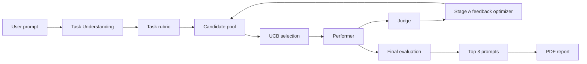

# PromptLab

PromptLab is a general-purpose prompt optimizer for LLM tasks. It analyzes the user's intent, generates multiple candidate prompts, executes them against a performer model, evaluates outputs with a separate judge, then uses feedback-driven optimization and a UCB multi-armed bandit to refine the best candidates.

## Architecture



## Workflow

1. Validate the prompt and extract TaskIntent. The UI displays the intent for user confirmation or edits before optimization begins.
2. Build and validate the task rubric, then generate the configured number of initial candidate prompts.
3. For each iteration, choose a shared sample and use UCB to select the active candidate set.
4. Execute each selected candidate with the Performer, then evaluate its actual response with the separate Judge.
5. Use each successful parent's own Judge feedback to create new child prompts. The session Insight Store carries evidence and provenance into subsequent Stage A calls.
6. Stop on the configured maximum iteration count, stagnation threshold, call budget, cancellation, or critical failure.
7. Re-evaluate eligible finalists and the original prompt baseline across the session samples, then rank by the independent final weighted scores.
8. Store the final results and create a PDF report from session data. A report is also attempted for terminal partial/failure sessions.

## Stage A and Stage B

Stage A is the feedback-driven optimization layer. It turns each selected parent's own feedback into a new child prompt while preserving intent and avoiding unsupported assumptions. Session insights are supplementary context, not a replacement for parent-specific feedback.

Stage B is the bandit layer. It does not rewrite prompts. At the beginning of each round, it chooses which currently known candidate prompts should be active and tested using a UCB formula. Children appended after a round become eligible in the next round.

## UCB explanation

The bandit keeps track of each candidate's reward, pull count, and average reward. The exploration term ensures new candidate prompts get a chance to be tested when they are still unproven. The formula is:

UCB_i = meanReward_i + c * sqrt(ln(N) / n_i)

where n_i is the count for candidate i and N is the total number of pulls.

## Intent fidelity

Intent fidelity is a first-class evaluation criterion. PromptLab asks whether the optimized prompt preserves the original objective, audience, explicit requirements, and constraints without introducing unsupported assumptions.

This feature reduces the common failure mode where a phrase such as "I am five" leads the system to invent irrelevant age-based details instead of actually adapting the response to a five-year-old audience.

## Judge scoring

The judge scores responses against the task-specific rubric and calculates a weighted quality value. The reward is normalized to the 0-1 range and used as the bandit reward.

## Configuration

Set required values using environment variables. A safe template appears in `.env.example`.

Required runtime values:
- GEMINI_API_KEY
- GROQ_API_KEY

Optional tuning variables:
- PORT
- OPTIMIZER_MODEL
- PERFORMER_MODEL
- JUDGE_MODEL
- DEFAULT_ACTIVE_CANDIDATES
- DEFAULT_EDITED_CANDIDATES
- DEFAULT_MAX_ITERATIONS
- DEFAULT_FINAL_TOP_N
- DEFAULT_UCB_C
- DEFAULT_STAGNATION_LIMIT
- DEFAULT_MIN_IMPROVEMENT
- DEFAULT_MAX_LLM_CALLS
- MIN_PROMPT_CHARS
- MAX_PROMPT_CHARS
- ALLOW_MOCK_LLMS

When `ALLOW_MOCK_LLMS=true`, deterministic local TaskIntent/rubric/candidate/Performer/Judge behavior is used and explicitly marked as mock. Mock operation does not test provider connectivity or live model behavior. When mock mode is disabled, Gemini and Groq keys are required. The Judge uses Groq's OpenAI-compatible API with the `openai` Python SDK pointed at `https://api.groq.com/openai/v1`; this SDK dependency is a client library, not a requirement for an OpenAI API key or OpenAI Judge account.

## Session state

PromptLab keeps the complete current optimization session in backend memory only. No database is used and no persistent session storage is required. Sessions are available only while the application is running.

## Security notes

Provider keys are read from server-side environment variables and are not accepted from or returned to the browser. The browser uses same-origin API routes; CORS is not enabled. The application sets restrictive browser security headers, applies request-field size limits, and escapes user/generated text in PDF content. Prompts and model-produced fields are untrusted input: prompt instructions request that providers treat embedded content as data, but this is not a guarantee against all prompt-injection attacks. Do not expose the unauthenticated development server directly to untrusted networks.

## Local setup

1. Create a virtual environment if desired.
2. Install dependencies:
   ```bash
   python -m pip install -r requirements.txt
   ```
3. Copy `.env.example` to `.env` and fill in values.
4. Start the app:
   ```bash
   uvicorn app.main:app --reload --host 0.0.0.0 --port 8000
   ```

## Useful development commands

```bash
python -m pytest
python -m compileall app
```

## API documentation

FastAPI includes interactive docs at:
- `/docs`
- `/redoc`

Core optimization endpoints:
- `POST /api/optimization/start`
- `POST /api/optimization/{session_id}/confirm-understanding`
- `GET /api/optimization/{session_id}`
- `GET /api/optimization/{session_id}/progress`
- `GET /api/optimization/{session_id}/results`
- `GET /api/optimization/{session_id}/report`
- `POST /api/optimization/{session_id}/cancel`

## PDF report structure

The PDF report includes the original prompt and context, confirmed TaskIntent, rubric criteria and weights, samples, full candidate prompts and lineage, optimization-time Performer responses and Judge feedback, per-iteration UCB decisions, session insights and provenance, final finalist evaluations, original-prompt baseline, Top 3, model/configuration metadata, errors and limitations. User-provided and generated text is escaped before being rendered.

## Research methodology

This project separates optimization-time evaluation from final evaluation. During optimization, the judge scores candidates and the UCB selector manages exploration versus exploitation. Before presenting the final results, the system performs a dedicated final evaluation over the best candidates to reduce bias from selection mechanics.

## Edge cases and constraints

- Empty or short prompts are rejected.
- Overlong prompts are rejected with a clear message.
- Missing API keys are surfaced as configuration errors.
- All candidate failures are handled without crashing the whole session.
- Duplicate candidate prompts are flagged and managed.
- Prompt injection is treated as untrusted user data.
- Visualization remains purposefully simple and research-oriented.

## Limitations

- Judge evaluation is useful but not absolute truth.
- Some tasks are inherently subjective.
- UCB is a selection mechanism, not proof of global optimality.
- Session data is in-memory only and does not survive a process restart.

## Example workflow

```text
User: "Create a study plan for me."
→ Task understanding extracts goals, audience, and constraints.
→ A rubric is created for planning.
→ Six initial prompts are generated.
→ Performer runs each prompt against a shared sample.
→ Judge scores all responses.
→ Best candidates are edited using feedback.
→ UCB chooses the next active set.
→ The process continues until stopping criteria are met.
→ Final evaluation picks the top 3 prompts and produces a PDF report.
```
